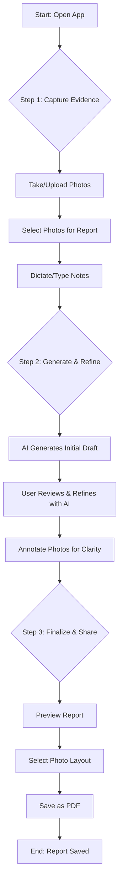

# HandyAI Report - User Experience (UX) Specifications

This document outlines the user's journey through the HandyAI Report application. It is intended for all stakeholders (product, design, marketing, leadership) to build a shared understanding of the user experience. It focuses on the "why" and "how" from a user's perspective, not a technical one.

## 1. High-Level User Journey

This is the primary "happy path" a user takes to successfully create a report.



---

## 2. Detailed Feature Breakdown

### Feature: Step 1 - Capture Evidence

**a. The Goal (Job Story):**
*   **When I've just finished a job, I want to quickly capture photos of my work and add notes, so I can create an accurate report for my client without forgetting important details.**

**b. User Experience Principles:**
*   **Speed:** The user should be able to go from opening the app to having photos captured in seconds. The interface should feel immediate and responsive.
*   **Clarity:** It must be obvious how to use the camera, upload existing photos, and add notes. There should be no ambiguity.
*   **Forgiveness:** The user can easily delete a bad photo or edit their notes without penalty. The experience is low-stress.

**c. Low-Fidelity Wireframe (ASCII):**
*   This wireframe shows the initial state of the capture screen.

```plaintext
+-----------------------------------------------------------------+
| HandyAI Report                                  [Start New Report] |
+-----------------------------------------------------------------+
|                                                                 |
|  Step 1: Capture Your Work                                      |
|  Take photos of the job you completed...                        |
|                                                                 |
|  +-----------------------------------------------------------+  |
|  |             +---------------------+                       |  |
|  |             |  [ 🖼️ Add from Gallery ]  |                       |  |
|  |             |  [ 📷 Start Camera ]   |                       |  |
|  |             +---------------------+                       |  |
|  +-----------------------------------------------------------+  |
|                                                                 |
|  (Your captured photos will appear below as thumbnails)         |
|  [ ✓ Photo 1 ] [ ✓ Photo 2 ] [   Photo 3 ] [ ✓ Photo 4 ]        |
|  *Click a photo to select/deselect it. Drag to reorder.*        |
|                                                                 |
|  Step 2: Add Notes (Optional)                                   |
|  Dictate any specific details...                                |
|                                                                 |
|  +-----------------------------------------------------------+  |
|  | [ 🎤 Start Dictation ]                                    |  |
|  | | Your dictated notes or typed text will appear here... |  |
|  +-----------------------------------------------------------+  |
|                                                                 |
|                  [ Generate Report (3 photos selected) -> ]     |
|                                                                 |
+-----------------------------------------------------------------+
```

**d. Interaction Flow & User Experience:**

1.  **Initial View:** The user sees two primary actions: "Add from Gallery" and "Start Camera". The feeling is **inviting and straightforward**.
2.  **Capturing Photos:** Tapping "Start Camera" opens the live camera view seamlessly. Each photo taken instantly appears as a thumbnail below, pre-selected for the report. This feels **efficient and satisfying**.
3.  **Managing Photos:** The user can tap any thumbnail to deselect it. The main "Generate Report" button count updates in real-time. This provides **immediate feedback and a sense of control**.
4.  **Dictating Notes:** Tapping "Start Dictation" provides clear visual feedback that the app is listening. Words appear as they are spoken. This feels **magical and effortless**.
5.  **Generating the Report:** The button is disabled until at least one photo is selected, providing **clear guidance**. Tapping it transitions the user smoothly to the next stage, giving a feeling of **progress and accomplishment**.

---

### Feature: Step 2 - Generate & Refine Report

**a. The Goal (Job Story):**
*   **When I have my photos and notes, I want the AI to write a professional report for me, so I don't have to worry about grammar and formatting, and then I want to easily make changes to get it perfect.**

**b. User Experience Principles:**
*   **Trust:** The initial AI-generated report should be high-quality and relevant, building the user's trust in the tool.
*   **Direct Manipulation:** The user should feel like they are directly editing the document by giving commands to a capable assistant. The interaction should be conversational.
*   **Guidance:** The app should proactively suggest ways to improve the report, making the user feel empowered and supported.

**c. Low-Fidelity Wireframe (ASCII):**
*   This wireframe shows the report refinement interface.

```plaintext
+-----------------------------------------------------------------+
| HandyAI Report                                [Preview & Finalize] |
+-----------------------------------------------------------------+
|                                                                 |
|  Step 3: Review and Refine Your Report                          |
|                                                                 |
|  +-----------------------------------------------------------+  |
|  |  AI: Here is the draft of your report...                  |  |
|  |  +-----------------------------------------------------+  |  |
|  |  | # Work Report                                     |  |  |
|  |  |                                                   |  |  |
|  |  | Based on the photos, the following work was...    |  |  |
|  |  | * Task 1...                                       |  |  |
|  |  | * Task 2...                                       |  |  |
|  |  +-----------------------------------------------------+  |  |
|  +-----------------------------------------------------------+  |
|  |  You: Make the tone more formal.                        |  |
|  +-----------------------------------------------------------+  |
|                                                                 |
|  Evidence Tray: [Photo 1 ✨] [Photo 2 ✨]  [+ Add More Photos]  |
|                                                                 |
|  💡 AI Suggestion: [Add a table with itemized costs]          |
|                                                                 |
|  +-----------------------------------------------------------+  |
|  | [ Enter your request... e.g., "Add a conclusion" ] [🎤] [->] |  |
|  +-----------------------------------------------------------+  |
|  [Make it more detailed] [Check for spelling] [Rephrase intro]  |
|                                                                 |
+-----------------------------------------------------------------+
```

**d. Interaction Flow & User Experience:**

1.  **Initial View:** The user first sees a loading indicator, then the AI-generated report appears. The result feels **impressive and valuable**.
2.  **Refining Text:** The user types or dictates a command like, "Add a bullet point about the new valve." The AI report block is updated in place, with the new text briefly highlighted. The interaction feels **responsive and direct**.
3.  **Annotating Photos:** Clicking the "✨" icon on a photo in the tray opens a modal. The AI suggests what to highlight. The user confirms or edits the prompt, and a new, annotated version of the photo is created. This workflow feels **intelligent and helpful**. After annotating, the AI suggests a text snippet to add to the report about the annotation, creating a **seamless and guided experience**.
4.  **Using Suggestions:** The AI provides "prompt pills" (e.g., "Add itemized costs"). Clicking one instantly sends that command. This makes the user feel **smart and efficient**, as if the AI is anticipating their needs.

---

### Feature: Step 3 - Finalize & Share

**a. The Goal (Job Story):**
*   **When my report is perfect, I want to format it nicely with the photos and save it as a professional-looking PDF, so I can send it to my client.**

**b. User Experience Principles:**
*   **Professionalism:** The final output must look clean, branded, and well-structured. The user should feel proud to share it.
*   **Control:** The user should have simple, meaningful choices over the final presentation (like photo layout).
*   **Simplicity:** Saving the final document should be a clear, one-click action.

**c. Low-Fidelity Wireframe (ASCII):**
*   This wireframe shows the final preview and save screen.

```plaintext
+-----------------------------------------------------------------+
| HandyAI Report                                  [Start New Report] |
+-----------------------------------------------------------------+
|                                                                 |
|  Step 4: Final Report Preview                                   |
|  [< Back to Editor]                          [ 💾 Save as PDF ]   |
|                                                                 |
|  Photo Layout: [ 1 Column ] [ 2 Columns ] [ 3 Columns ]         |
|                                                                 |
|  +-----------------------------------------------------------+  |
|  |  HandyAI Work Report                                      |  |
|  |  Date: ...                                                |  |
|  |  -------------------------------------------------------  |  |
|  |                                                           |  |
|  |  The full, formatted report text appears here, looking    |  |
|  |  exactly as it will in the PDF.                           |  |
|  |                                                           |  |
|  |  Supporting Photos                                        |  |
|  |  +-----------+  +-----------+                             |  |
|  |  |           |  |           |                             |  |
|  |  |  Photo 1  |  |  Photo 2  |                             |  |
|  |  |           |  |           |                             |  |
|  |  +-----------+  +-----------+                             |  |
|  |                                                           |  |
|  +-----------------------------------------------------------+  |
|                                                                 |
+-----------------------------------------------------------------+
```

**d. Interaction Flow & User Experience:**

1.  **Entering Preview:** The user transitions from the editor to a clean, polished view of their report. This feels like moving from a "workshop" to a "showroom".
2.  **Changing Layout:** The user clicks the layout tabs ("1 Column", "2 Columns"). The photo gallery below instantly rearranges. This interaction is **fast and satisfying**, giving the user a tangible sense of control over the final product.
3.  **Saving PDF:** The user clicks "Save as PDF". A loading indicator appears on the button, and then the browser's save dialog opens. The action is **simple, reliable, and conclusive**. The user feels a sense of **finality and accomplishment**.
